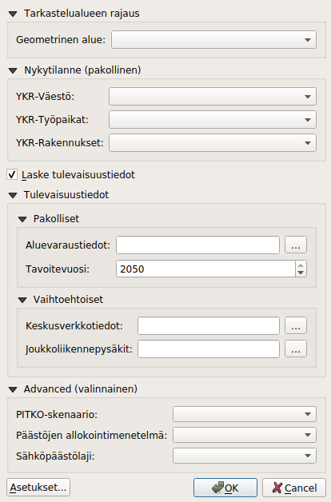

# Climate Tool

Climate Tool is a QGIS plugin for assessing climate impacts in cities. The plugin is under development and will be released here in June 2019. The tool is modelling the climate impacts in the cities. It provides  information about the current situation in the cities by calculating the  energyefficiency of the city. It also provides scenarios for the future. In the inital phace only datasets from the City of Tampere are used. The plugin will need a PostGIS connection in order to work. 

## Team

**Developed by the joint cooperation of [City of Tampere](https://www.tampere.fi/), [Ubigu Ltd](https://www.ubigu.fi/en/), [Tietotakomo](https://www.tietotakomo.fi/) & [Gispo Ltd](https://www.gispo.fi/en/home/).**

The plugin is still in beta-development. Please report issues to mikael@gispo.fi.

Many thanks to the project team!*

## Licences

This plugin utilizes data proviced by Statistics Finaland and Finland's environmental administration **Please read [https://www.stat.fi/tup/ykraineistot/index.html](https://www.stat.fi/tup/ykraineistot/index.html) for more information.**

**Read also [data/lisence.txt](data/lisence.txt) for more information.**

## Installation instructions

Coming up

## Software requirements

- QGIS 3.4.6
- PostgreSQL 9.4 (tested on PostgreSQL 9.6+)
- PostGIS 2.1.8 (tested on 2.2+)

## Climate Tool description

It takes into account several information from the cities:

- Building
- Traffic
- Public transportation
- Electricity consumption
- Heating
- Carbon sinks
- Land use plans
- Scenario information for the future

## Use cases

The tool can be used by city developers (land use planners) for
- Seeing the current situation for climate impacts in the community
- Detect the effects of land use planning (planned building, use and maintanence) in climate impacts
- See trends in climate impact changes in the future

## End results:

- 250*250 m grid, vector layers in PostGIS database
- different parameters attached to the grid (current situation and also future)
- visualisations (SLD) for different parameters and layer possibilities
- Map layers: current situation and optionally target year
- Tables: yearly scenarios

## Process
- Open QGIS
- Add QGIS Climate Tool plugin
- Check the PostGIS database connection
- Check that the grid data exists in the database (YKR = Urban Zone Grid by Finnish Environment Institute) 
- Open QGIS Climate Tool plugin

### Choosing reseach area
- Choose the area for your calculations (in this stage only City of Tampere)
- Choose a governmental area (it provides certain parameters to the calculations)

### Calculate current situation
- Add information about the current situation (Population, Jobs, Buildings)

### Calculate future information
- Choose if you want to calculate also future scenarios 
- Add land use planning zoning elements
- Set target Year
- Optional: add Keskusverkkotiedot (centers in the city by network information)
- Optional: add intensive public transportation stations (train, metro, tram)
- Advanced: add PITKO scenario (heating and electricity scenarios) or use default parameters
- Advanced: add emission allocation methods
- Advanced: add used electricity emission sources

## The datasets needed

[Dataset structure requirements](docs/dataset_requirements.md). See also [database model](docs/database.md). 

Present - user adds:
- Population (YKR) 
- Jobs (YKR)
- Buildings (YKR, based on building and housing registre called RHR) 

More accurate model for the present situation can be gained with:
- Buildings (current situation from the municipality, if available use instead of YKR building information)

Ready in the database:
- Basic grid for whole country (250*250 m) - in the database, includes also ground surface (in hectars) from YKR CLC2018 data
- Urban zones (yhdyskuntarakenteen vyöhykkeet, YKR 2015) - this dataset has been premodified and ready in the database
- Centres and commercial areas (KeskustaAlueet) - this dataset is ready in the database
- Regions (municipality borderds, now only City of Tampere as test area)
- Carbon sinks - ready made dataset in the database
- Energy information  - ready made dataset in the database
- Scenarios - PITKO (long term emission development) - ready made dataset in the database

Future scenarios - user adds:
- Land use planning Zoning elements (Käyttötarkoitusalueet)
- Centre network (Keskusverkko)
- Public transport plan (metro, train, tram)

## Documentation

- Technical documentation (in Finnish) coming up
- [Conceptual model](Ilmastoty%C3%B6kalu_k%C3%A4sitemalli_gispo.png)
- [Schema model](docs/database.md)
- SQL (coming up)
- Plugin documentation (coming up)

