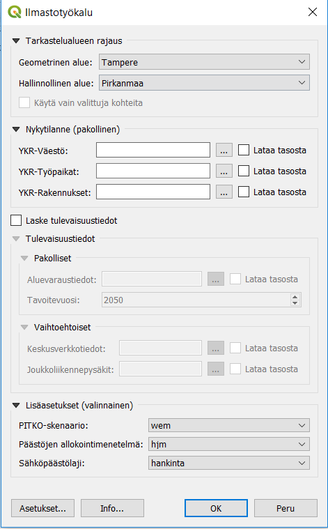
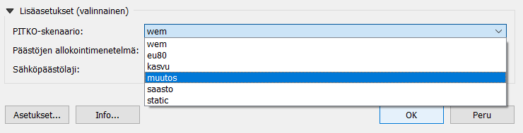

# Climate Tool

Climate Tool is a QGIS plugin for assessing climate impacts in cities. The plugin is under development and will be released here in June 2019. The tool is modelling the climate impacts in the cities. It provides  information about the current CO2 emission situation in the cities by taking into account various emission sources. It also provides scenarios for the future using land use planning information. In the inital phace only datasets from the City of Tampere are used. The plugin will need a PostGIS connection and several ready made datasets in the database in order to work. 

## Team

**Developed by the joint cooperation of [City of Tampere](https://www.tampere.fi/), [Ubigu Ltd](https://www.ubigu.fi/en/), [Tietotakomo](https://www.tietotakomo.fi/) & [Gispo Ltd](https://www.gispo.fi/en/home/).**

The plugin is still in beta-development. Please report issues to mikael@gispo.fi.

Many thanks to the project team!

## Licences

This plugin relies on urban zone data provided by Statistics Finland and Finland's environmental administration **Please read [https://www.stat.fi/tup/ykraineistot/index.html](https://www.stat.fi/tup/ykraineistot/index.html) for more information.**

**Read also [Lisence description](data/lisence.md) for more information.**

## Installation instructions

### Dependencies

Before installing the plugin, make sure to install the Python [requests-library](http://docs.python-requests.org/). This can be done by executing the command:

```pip install requests```

On Windows QGIS installations, installing the requests library can be done using the OSGeo4W Shell. Open the shell as an administrator and run commands:

```
py3_env
pip install requests
```

Python-requests may be replaced by the QGIS built-in [QgsFileDownloader](https://qgis.org/pyqgis/3.2/core/File/QgsFileDownloader.html) class in a future version of the plugin.

### QGIS Plugin

1. Download the repository as a zip using the Clone or download button in GitHub (above).

2. Launch QGIS and the plugins menu by selecting Plugins - Manage and Install Plugins from the top menu.

3. Select the Install from ZIP tab, browse to the zip file you just downloaded, and click Install Plugin!

## Usage

Using the plugin is fairly straightforward:

**1. The tool can be found after installation under Plugins > Ilmastovaikutusten arviointityökalu**

**2. Check the database connection from Setup / Asetukset (in the bottom of the plugin dialogue).** If you do not have the access, contact info@ubigu.fi).



**3. Select the study area / Tarkastelualueen rajaus**
- Area / Geometrinen alue (at the moment only City of Tampere is possible)
- Select governmental area / Hallinnollinen alue (at the moment only region of Pirkanmaa)

**4.  Add at least these datasets from your own files (e.g. in shp. -format)** in order to calculate current situation of the climate assessment [(check out data requirements)](docs/dataset_requirements.md). You can add them from your files or from the layer list: 
- YKR rakennukset (Urban grid buildings)
- YKR väestö (Urban grid population)
- YKR työpaikat (Urban grid jobs)

**5. Run the calculation.**

**6. If you want to calculate future scenarios (Laske tulevaisuustiedot), add at least these datasets:**
- Zoning elements (Aluevaraustiedot) [(check out data requirements)](docs/dataset_requirements.md)
- Target year (Note that the calculation will be created for every year and it might take a while)

**7. Optional: add also central network information (keskusverkkotiedot) and public trafic stops (joukkoliikennepysäkit)** [(check out data requirements)](docs/dataset_requirements.md).

**8. Advanced: choose suitable methods for calculation**



- Add PITKO scenario (heating and electricity scenarios) or use default parameters. Options are different scenarios accoriding of a Long term emission developement study [PITKO](https://tietokayttoon.fi/hankkeet/hanke-esittely/-/asset_publisher/pitkan-aikavalin-kokonaispaastokehitys-pitko-). Possible values are: ‘eu80’, ‘kasvu’, ‘muutos’, ‘saasto’, ‘wem’.

- Add emission allocation methods. Possible values are ‘em’=[energiamenetelmä](http://www.ym.fi/download/noname/%7BA6ABCFF7-55FA-412C-A0C7-FEE5CC0A2F24%7D/30744) (energy method) and ‘hjm’=[hyödynjakomentelmä](https://www.motiva.fi/files/6820/Kuvaus_hyodynjakomenetelmasta.pdf) (method for calculating emissions).

- Add used electricity emission types. Possible values are 'hankinta'=purchase and 'tuotanto'=provision. 

## End results:

- 250*250 m grid, vector layers in PostGIS database
- CO2 emissions of different emission sources in the cities. Current situation as map layer.
- Predictions of CO2 emissions in the future (using scenarios from land use planning). One map layer with all target years. These can be sorted or visualized further.
- Ready made visualizations for the map layers including grids and top emission source/grid cell

## Documentation

- [Database and database model](docs/database.md)
- [Descriptions for visualizations](docs/visualizations.md)
- [Dataset requirements](docs/dataset_requirements.md)
- [Data lisences](data/lisence.md)

## Software requirements

- QGIS 3.4.6
- PostgreSQL 9.4 (tested on PostgreSQL 9.6+)
- PostGIS 2.1.8 (tested on 2.2+)

## Description

The tool can be used by city developers (land use planners) for
- Understanding the current situation of CO2 emissions in the community
- Detect the effects of land use planning (planned building, use and maintanence) in CO2 emission levels
- See trends in of CO2 emission changes in the future

Climate Tool takes into account several data sources from the cities:

- Building
- Traffic
- Public transportation
- Electricity consumption
- Heating
- Carbon sinks
- Land use plans
- Scenario information for the future


