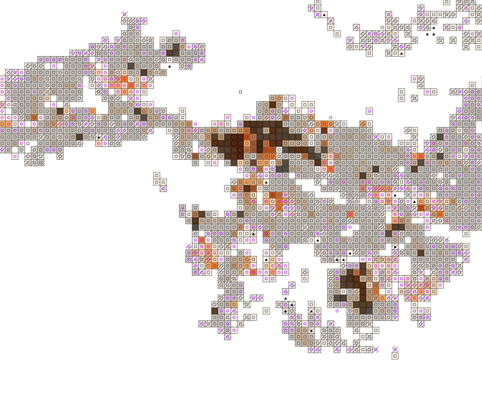
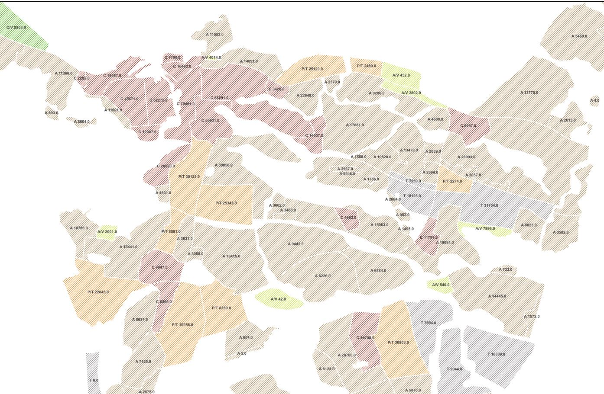

## Visualization information for the tool

Automatic visualisation is created automatically from QGIS plugin. It uses Natural Breaks divison with ready defined colorscheme. QML-files for the visualisation:

- [CO2_t_grid](CO2_t_grid.qml)

- [CO2_sources](CO2_sources.qml)

- [Population](Population.qml)

[Examples](CO2_visualisoinnit.pdf) of possible end results.

[SLD's](visualizations_SLD) have been also created, they can be used e.g. with GeoServer.

[SLD for CO2 emmissions per grid](co2%20emissions.sld)

### Additional SLD-files from grids:

[SLD for population grids](visualizations_SLD/population.sld)

[SLD for top emission source per grid cell](visualizations_SLD/top%20emission%20source%20per%20grid%20cell.sld)

Example with all grid layers:

### SLD-file for zoning elements (not part of the plugin, but if you want to join grid information for zoning)

[SLD for top emission source per land use planning zones](visualizations_SLD/top%20emission%20source%20per%20land%20use%20planning%20zones.sld), example:

